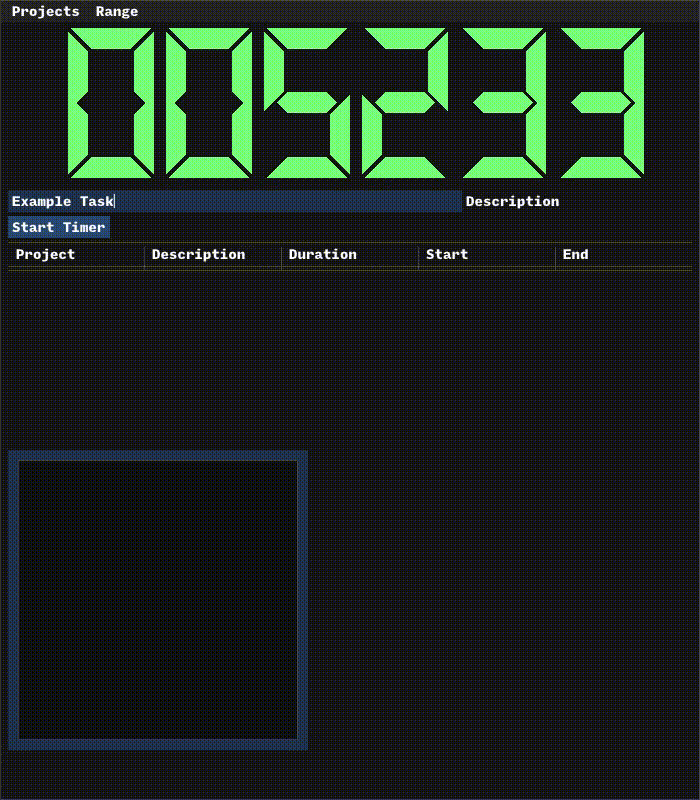
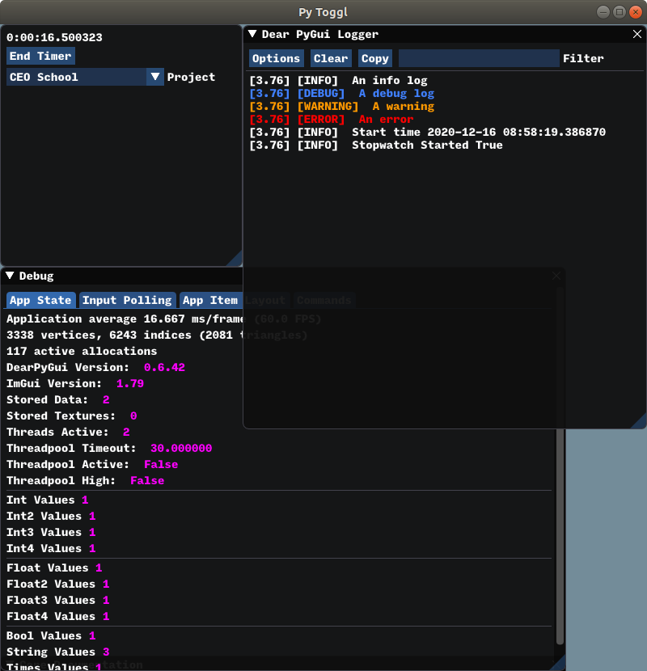

# ClockPuncher

## Abstract

This is a small python utility app that is being designed for time-tracking. As the name suggests, this is trying to replace track.toggl.com for tracking my own work.

The end-goal is a local, open-source timer that is hackable and can automate specific tasks like uploading/submitting billable hours.

## Images
### 'Production' GUI for usage

### Development GUI with logger and debugger windows

## Installation

The best way is to use [pipx](https://pipxproject.github.io/pipx/) and run `pipx install clockpuncher` or `pipx run clockpuncher`.

On install a folder will be created in `~/.clockpuncher` to contain local data storage. It should contain a single folder 'data' with a sqlite db called `timer.db` and possibly wal files. It's literally just a sqlite database, you can access, query, and adjust as you would with any other database.

You can delete this folder without issue, but you will lose all your stored data.

## Current Next Steps:
* [X] Integrate sqlite DB of timer sessions
* [X] Add inputs for specific task descriptions (text box)
* [ ] Add on-the-fly graph representations
  * [X] Task Breakdown
  * [ ] Total Hours (per task and total)
  * [ ] Total Billed (per task and total)
* [ ] Add report CSV output
* [ ] Add tests for main.py + gui module
* [X] Put on PyPI
* [X] Setup with pipx for app deployment
* [ ] Add user settings with persistent storage
* [ ] Add database back-up/cold-storage option

## Repo Structure

This repo follows a pretty standard layout with `main.py` being the GUI front-end + database composed together to make the stopwatch app itself.

### Outline:

* `clockpuncher/`  - contains all code required to run Clock Puncher
   * `main.py` - The main file that combines GUI, database, and application logic to make the above images
   * `database.py` - Contains the Database class that does CRUD operations for main.py
   * `models.py` - Dataclasses that represent rows in the Entries and Projects table
   * `data/` - Contains local data storage. In production it stores data in `data/timer.db`
   * `gui/` - All reusable GUI components
     * `base_gui.py` - Base GUI class with loggers and basic development/production switchers.
     * `dev_gui.py` - This holds quick GUI screens tossed together for development.
     * `entry_visualization.py` - Contains task_chart and entry_table components and their class definitions
      * `timer.py` - Contains Timer and Number GUI components that make up the clock display
   * `tests` - Test suite using Pytest + Hypothesis

