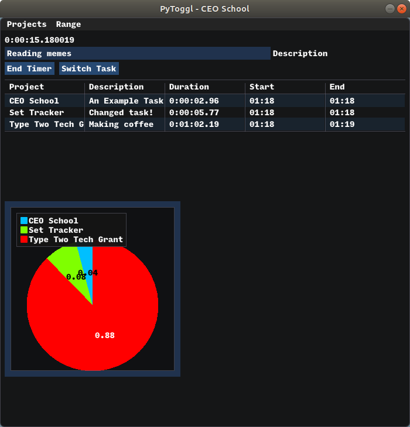

# Analytical Stopwatch

## Abstract

This is a small python utility app that is being designed for time-tracking. As the name suggests, this is trying to replace track.toggl.com for tracking my own work.

The end-goal is a local, open-source timer that is hackable and can automate specific tasks like uploading/submitting billable hours.

## Images
### 'Production' GUI for usage

### Development GUI with logger and debugger windows


## Current Next Steps:
~~* Integrate sqlite DB of timer sessions~~
* Add inputs for specific task descriptions (text box)
* Add inputs for tags
* Add report CSV output
* Add on-the-fly graph representations

## Repo Structure

### AnalyticStopwatch/src

### gui.py
Two main classes - 
* BaseGUI 
* PyTogglGUI that inherits from BaseGUI

#### BaseGUI
This has basic initialization of screens, loading of fonts, and development tools. The biggest help here is the .log functions which make logging in PyTogglGUI much simpler.

#### PyTogglGUI
This is the timer tracking class. Lots of properties and setters but the meat is:
* `flip_timer_state` that activates the stopwatch function
* `render` which updates the clock/timer text on each frame draw
* `run` which builds the timer window itself

Creating the GUI can be as simple as:
```python
gui = PyTogglGUI(development=False, db_uri="sqlite_filepath")
gui.run()
```

### database.py
Contains Database class that handles initialization and helper methods for accessing local sqlite db.

### models.py
Contains dataclasses for:
* Entry
* Project

Also contains a base class with helper methods used in the above.

#### ModelHelperMixin
There are 2 simple methods and 2 rather fancy methods implemented:

simple helpers are:
* `to_dict` which is convenience for calling asdict on the dataclass
* `get` which uses the getattr on self but with no default

Some base validation has been created on attributes with:
* `__post_init__`
* `_check_if_annotation_matches`
 
`__post_init_` Validates that all attributes match their type annotation and that all integers can be converted to a sqlite valid integer. Thank you Hypothesis for pointing this out although if I'm ever making a rate of more than 9223372036854775807 on a project then I might have to upgrade the database.

### AnalyticalStopwatch/src/tests

Use of hypothesis testing and pytest. Quite exciting!