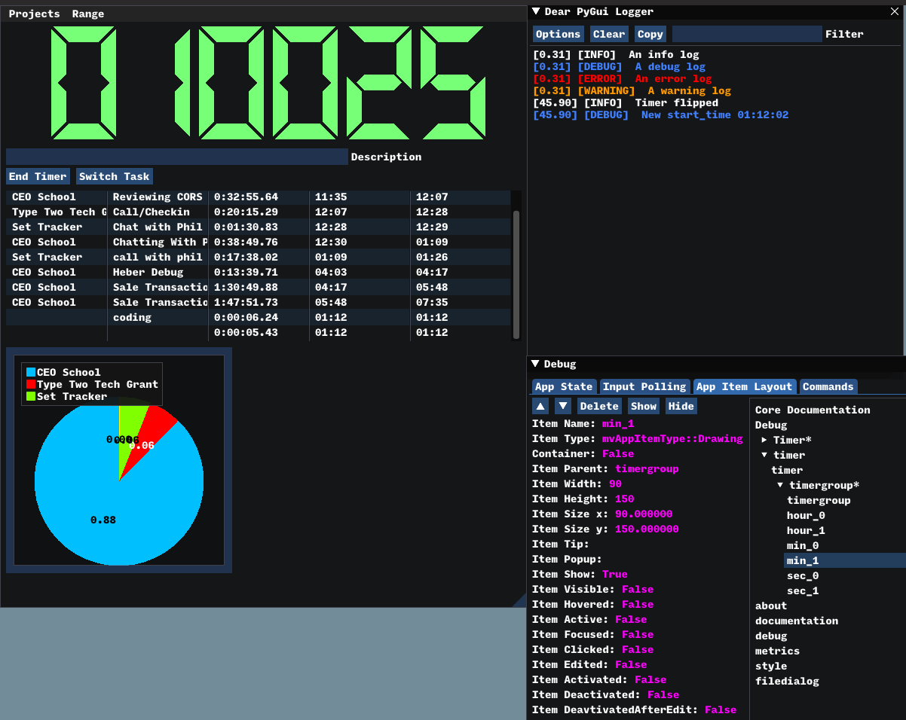

# Analytical Stopwatch

## Abstract

This is a small python utility app that is being designed for time-tracking. As the name suggests, this is trying to replace track.toggl.com for tracking my own work.

The end-goal is a local, open-source timer that is hackable and can automate specific tasks like uploading/submitting billable hours.

## Images
### 'Production' GUI for usage

### Development GUI with logger and debugger windows


## Current Next Steps:
* Integrate sqlite DB of timer sessions
* Add inputs for specific task descriptions (text box)
* Add inputs for tags
* Add report CSV output
* Add on-the-fly graph representations

## Repo Structure

### AnalyticStopwatch/src

### gui.py
Two main classes - 
* BaseGUI 
* PyTogglGUI that inherits from BaseGUI

#### BaseGUI
This has basic initialization of screens, loading of fonts, and development tools. The biggest help here is the .log functions which make logging in PyTogglGUI much simpler.

#### PyTogglGUI
This is the timer tracking class. Lots of properties and setters but the meat is:
* flip_timer_state that activates the stopwatch function
* render which updates the clock/timer text on each frame draw
* run which builds the timer window itself

Creating the GUI can be as simple as:
```python
gui = PyTogglGUI(development=False, db_uri="sqlite_filepath")
gui.run()
```